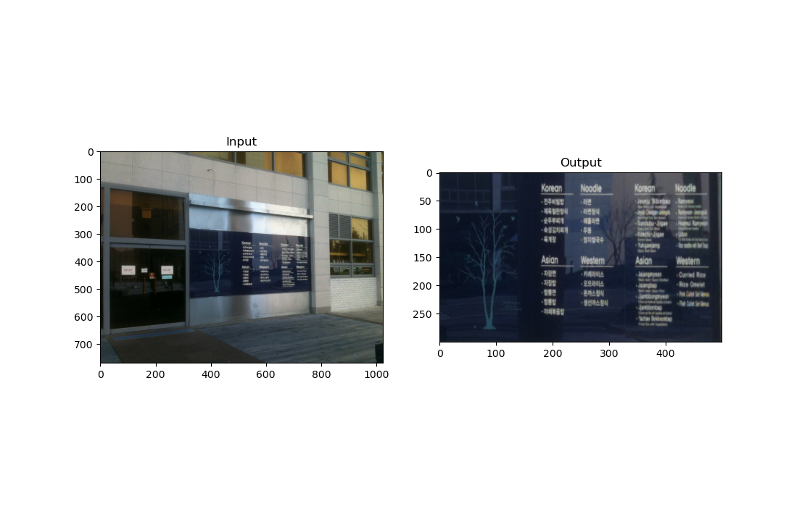

# Image Processing Homework

HOMEWORK1
</img>

https://youtu.be/K7u-uZ-lc94?si=TVwsvxYdFzFtN4Zu

HOMEWORK2

https://youtu.be/VQmUT6_cMJ8

HOMEWORK3
</img>

HOMEWORK4

HOMEWORK5
https://youtu.be/0rzsQ86UpMU

